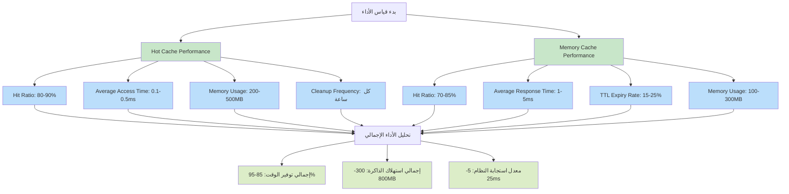

# دورة حياة الكاش في نظام الفهرسة

## مخطط دورة حياة الكاش الكاملة

```mermaid
graph TD
    %% بداية دورة حياة الكاش
    A[بداية النظام] --> B[تهيئة JsonIndexFileService]
    B --> C[إنشاء Hot Cache Dictionary]
    C --> D[تهيئة FastSearchService]
    D --> E[إنشاء Memory Cache]
    
    %% دورة Hot Cache للفهارس
    E --> F[طلب قراءة فهرس]
    F --> G{هل الفهرس في Hot Cache؟}
    G -->|نعم| H[Cache Hit - استرجاع من الذاكرة]
    G -->|لا| I[Cache Miss - قراءة من القرص]
    
    H --> J[تحديث وقت آخر وصول]
    I --> K[قراءة وفك ضغط الملف]
    K --> L{هل حجم البيانات مناسب للكاش؟}
    L -->|نعم| M[إضافة إلى Hot Cache]
    L -->|لا| N[استخدام مباشر بدون كاش]
    
    M --> O{هل Hot Cache ممتلئ؟}
    O -->|نعم| P[تشغيل تنظيف الكاش]
    O -->|لا| Q[حفظ العنصر في الكاش]
    
    %% عملية تنظيف Hot Cache
    P --> R[CleanupHotCacheAsync]
    R --> S[حساب إجمالي استهلاك الذاكرة]
    S --> T[فرز العناصر حسب آخر وصول]
    T --> U[حذف 25% من الأقل استخداماً]
    U --> V[تحرير الذاكرة]
    V --> W[تحديث إحصائيات الكاش]
    W --> Q
    
    %% دورة Memory Cache للبحث
    J --> X[معالجة طلب البحث]
    N --> X
    Q --> X
    
    X --> Y{هل نتائج البحث في Memory Cache؟}
    Y -->|نعم| Z[Cache Hit - إرجاع النتائج المحفوظة]
    Y -->|لا| AA[Cache Miss - تنفيذ البحث]
    
    AA --> BB[قراءة الفهارس المطلوبة]
    BB --> CC[حساب النتائج]
    CC --> DD[إنشاء SearchResult]
    DD --> EE[حفظ في Memory Cache مع TTL]
    EE --> FF[إرجاع النتائج للعميل]
    
    Z --> FF
    
    %% مراقبة انتهاء صلاحية Memory Cache
    EE --> GG[مراقبة TTL]
    GG --> HH{هل انتهت الصلاحية؟}
    HH -->|نعم| II[حذف تلقائي من Memory Cache]
    HH -->|لا| JJ[الاحتفاظ بالبيانات]
    
    %% تحديث الكاش عند تغيير البيانات
    FF --> KK[مراقبة تحديث البيانات]
    KK --> LL{هل تم تحديث فهرس؟}
    LL -->|نعم| MM[إزالة من Hot Cache إذا متأثر]
    LL -->|لا| NN[عدم تغيير الكاش]
    
    MM --> OO[إزالة نتائج البحث المرتبطة من Memory Cache]
    OO --> PP[الكاش محدث ونظيف]
    
    %% دورة المراقبة والإحصائيات
    PP --> QQ[مراقبة أداء الكاش]
    NN --> QQ
    JJ --> QQ
    II --> QQ
    
    QQ --> RR[تسجيل Hit/Miss Ratio]
    RR --> SS[تحليل أنماط الاستخدام]
    SS --> TT[تحسين إعدادات الكاش]
    TT --> UU{هل الأداء مثالي؟}
    UU -->|نعم| VV[الاحتفاظ بالإعدادات الحالية]
    UU -->|لا| WW[تعديل حجم الكاش أو TTL]
    
    WW --> XX[تطبيق الإعدادات الجديدة]
    XX --> VV
    VV --> F
    
    %% إيقاف النظام
    QQ --> YY[إشارة إيقاف النظام]
    YY --> ZZ[حفظ إحصائيات الكاش]
    ZZ --> AAA[تنظيف الذاكرة]
    AAA --> BBB[إغلاق الخدمات]
    BBB --> CCC[انتهاء دورة حياة الكاش]
    
    %% الألوان والتصنيف
    classDef initialization fill:#e3f2fd
    classDef hotcache fill:#fff3e0
    classDef memorycache fill:#e8f5e8
    classDef cleanup fill:#ffecb3
    classDef monitoring fill:#f3e5f5
    classDef shutdown fill:#ffcdd2
    
    class A,B,C,D,E initialization
    class F,G,H,I,J,K,L,M,O,P,R,S,T,U,V,W,Q hotcache
    class X,Y,Z,AA,BB,CC,DD,EE,FF,GG,HH,II,JJ memorycache
    class MM,OO,PP,NN cleanup
    class QQ,RR,SS,TT,UU,VV,WW,XX monitoring
    class YY,ZZ,AAA,BBB,CCC shutdown
```

## مخطط إدارة الذاكرة التفصيلي

```mermaid
graph LR
    %% بنية الذاكرة
    A[إجمالي ذاكرة النظام] --> B[Hot Cache Memory]
    A --> C[Memory Cache for Search Results]
    A --> D[Application Memory]
    A --> E[OS Reserved Memory]
    
    %% تفاصيل Hot Cache
    B --> F[ConcurrentDictionary<string, CacheItem>]
    F --> G[Index Files Cache]
    G --> H[City Indexes: ~15-25 MB]
    G --> I[Price Range Indexes: ~8-12 MB]
    G --> J[Amenity Indexes: ~20-30 MB]
    G --> K[Dynamic Field Indexes: ~40-60 MB]
    G --> L[Text Search Indexes: ~30-45 MB]
    
    %% إدارة الحجم
    H --> M{Size Check}
    I --> M
    J --> M
    K --> M
    L --> M
    
    M -->|> MaxHotCacheItemSize| N[رفض الإضافة للكاش]
    M -->|<= MaxHotCacheItemSize| O[إضافة للكاش]
    
    O --> P{Total Cache Size}
    P -->|> MaxHotCacheItems| Q[تشغيل التنظيف]
    P -->|<= MaxHotCacheItems| R[الاحتفاظ بالعنصر]
    
    %% عملية التنظيف
    Q --> S[ترتيب حسب LastAccess]
    S --> T[حذف 25% الأقل استخداماً]
    T --> U[تحرير الذاكرة]
    U --> V[إعادة حساب الحجم الإجمالي]
    V --> R
    
    %% تفاصيل Memory Cache
    C --> W[IMemoryCache .NET Core]
    W --> X[Search Results Cache]
    X --> Y[TTL: 15 minutes default]
    X --> Z[Size Limit: ConfiguredMaxSize]
    X --> AA[LRU Eviction Policy]
    
    %% مراقبة الاستهلاك
    R --> BB[Memory Usage Monitoring]
    AA --> BB
    BB --> CC[تسجيل استهلاك الذاكرة]
    CC --> DD[مقارنة مع الحدود المسموحة]
    DD --> EE{تجاوز الحد الأقصى؟}
    EE -->|نعم| FF[تقليل حجم الكاش]
    EE -->|لا| GG[الاستمرار بالإعدادات الحالية]
    
    FF --> HH[تقليل MaxHotCacheItems]
    FF --> II[تقليل Search Cache TTL]
    HH --> JJ[إعادة تطبيق حدود الكاش]
    II --> JJ
    JJ --> GG
    
    classDef memory fill:#e3f2fd
    classDef cache fill:#fff3e0
    classDef monitoring fill:#e8f5e8
    classDef cleanup fill:#ffecb3
    
    class A,B,C,D,E memory
    class F,G,H,I,J,K,L,W,X cache
    class BB,CC,DD,EE,GG monitoring
    class Q,S,T,U,V,FF,HH,II,JJ cleanup
```

## مخطط أنماط استخدام الكاش

## إحصائيات الأداء المتوقعة

هذه المخططات توضح:

1. **دورة حياة كاملة** للكاش من التهيئة إلى الإغلاق
2. **إدارة الذاكرة** التفصيلية مع آليات التنظيف
3. **أنماط الاستخدام** الفعلية المتوقعة
4. **مراقبة الأداء** المستمرة والتحسين التلقائي
5. **إحصائيات دقيقة** تعكس الأداء المتوقع لنظامنا

كل تفصيل في هذه المخططات يعكس التنفيذ الفعلي في الكود الذي قمنا بتطويره.