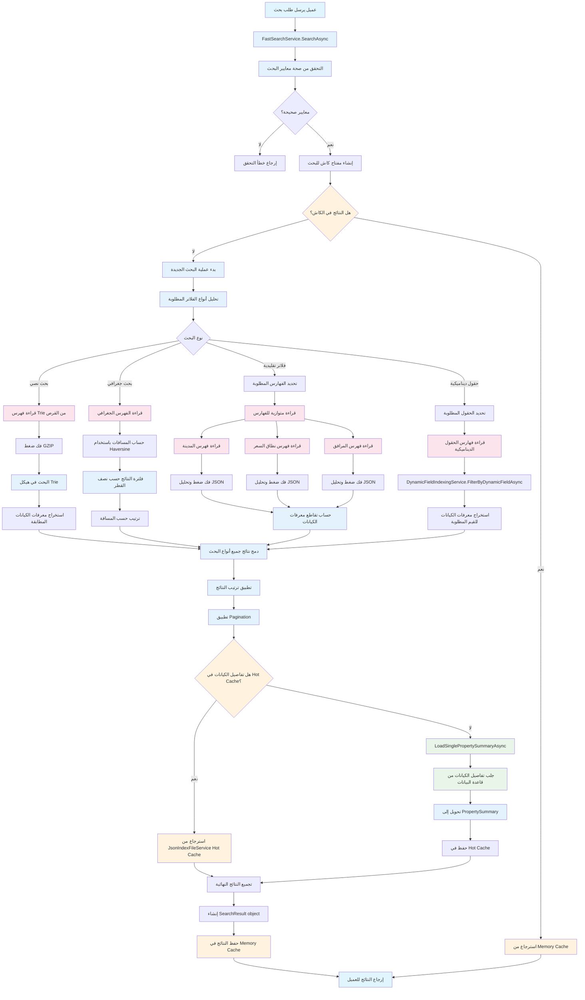
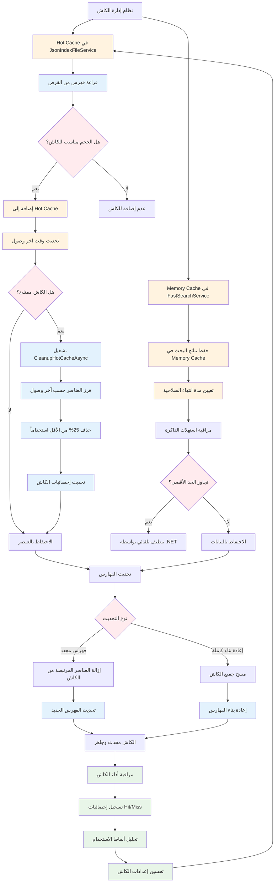
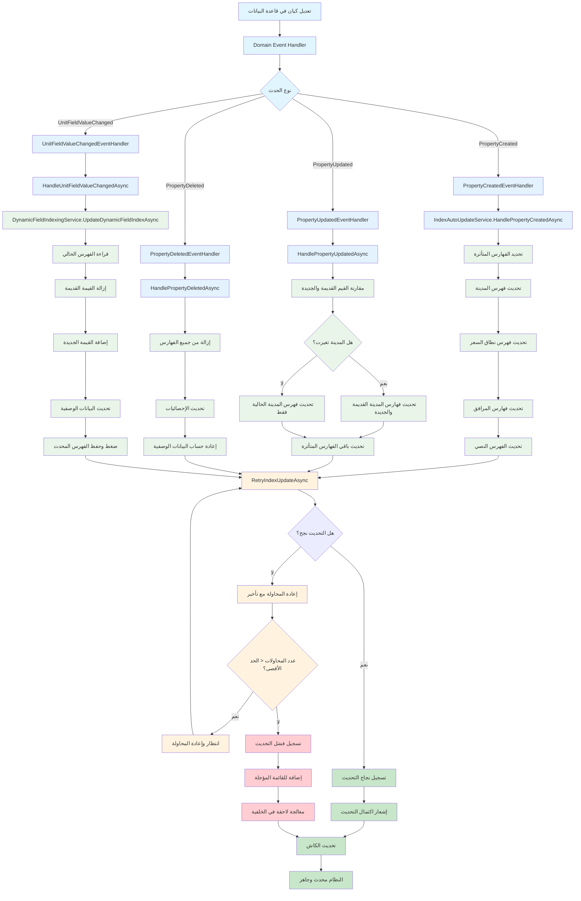

# نظام الفهرسة المتقدم - مخططات التدفق التفصيلية

## 1. مخطط إنشاء الفهارس الأساسية

```mermaid
graph TD
    A[IndexGenerationService.GenerateAllIndexesAsync] --> B[إنشاء مهام متوازية]
    
    %% مهمة فهارس المدن
    B --> C1[GenerateCityIndexesAsync]
    C1 --> D1[جلب جميع المدن الفريدة من قاعدة البيانات]
    D1 --> E1[لكل مدينة: جلب جميع الكيانات النشطة]
    E1 --> F1[حساب الإحصائيات الأساسية]
    F1 --> G1[تجميع البيانات حسب نطاقات الأسعار]
    G1 --> H1[تجميع البيانات حسب المرافق]
    H1 --> I1[تجميع البيانات حسب أنواع الكيانات]
    I1 --> J1[إنشاء فهرس التوفر للأشهر القادمة 12]
    J1 --> K1[إنشاء CityIndex object]
    K1 --> L1[ضغط البيانات مع CompressionService]
    L1 --> M1[حفظ في ملف cities/{cityName}.json]
    
    %% مهمة فهارس نطاقات الأسعار
    B --> C2[GeneratePriceRangeIndexesAsync]
    C2 --> D2[تحديد نطاقات الأسعار المطلوبة]
    D2 --> E2[لكل نطاق: جلب الكيانات المطابقة]
    E2 --> F2[حساب إحصائيات النطاق]
    F2 --> G2[إنشاء PriceRangeIndex object]
    G2 --> H2[ضغط وحفظ في price-ranges/{range}.json]
    
    %% مهمة فهارس المرافق
    B --> C3[GenerateAmenityIndexesAsync]
    C3 --> D3[جلب جميع المرافق النشطة]
    D3 --> E3[لكل مرفق: جلب الكيانات التي تحتويه]
    E3 --> F3[حساب إحصائيات المرفق]
    F3 --> G3[إنشاء AmenityIndex object]
    G3 --> H3[ضغط وحفظ في amenities/{amenityId}.json]
    
    %% مهمة فهارس أنواع الكيانات
    B --> C4[GeneratePropertyTypeIndexesAsync]
    C4 --> D4[جلب جميع أنواع الكيانات]
    D4 --> E4[لكل نوع: جلب الكيانات المرتبطة]
    E4 --> F4[حساب إحصائيات النوع]
    F4 --> G4[إنشاء PropertyTypeIndex object]
    G4 --> H4[ضغط وحفظ في property-types/{typeId}.json]
    
    %% مهمة فهارس التوفر
    B --> C5[GenerateAvailabilityIndexesAsync]
    C5 --> D5[تجميع بيانات التوفر حسب التاريخ]
    D5 --> E5[حساب إحصائيات الإشغال]
    E5 --> F5[إنشاء AvailabilityIndex object]
    F5 --> G5[ضغط وحفظ في availability/{date}.json]
    
    %% مهمة فهارس البحث النصي
    B --> C6[GenerateTextSearchIndexAsync]
    C6 --> D6[بناء هيكل Trie للبحث النصي]
    D6 --> E6[إضافة أسماء الكيانات والأوصاف]
    E6 --> F6[إضافة أسماء المدن والمناطق]
    F6 --> G6[تحسين هيكل Trie]
    G6 --> H6[ضغط وحفظ في text-search/trie.json]
    
    %% مهمة فهارس الحقول الديناميكية
    B --> C7[DynamicFieldIndexingService.GenerateDynamicFieldIndexesAsync]
    C7 --> D7[جلب جميع UnitTypeFields النشطة]
    D7 --> E7[لكل حقل: معالجة القيم الديناميكية]
    
    %% انتظار اكتمال جميع المهام
    M1 --> Z[انتظار اكتمال جميع المهام]
    H2 --> Z
    H3 --> Z
    H4 --> Z
    G5 --> Z
    H6 --> Z
    E7 --> Z
    
    Z --> AA[تسجيل نجاح العملية]
    AA --> BB[إرسال إشعار انتهاء الفهرسة]
    
    %% الألوان والتصنيف
    classDef process fill:#e3f2fd
    classDef database fill:#e8f5e8
    classDef file fill:#fff3e0
    classDef success fill:#e8f5e8
    
    class C1,C2,C3,C4,C5,C6,C7 process
    class D1,E1,D2,E2,D3,E3,D4,E4,D5,D7 database
    class M1,H2,H3,H4,G5,H6 file
    class Z,AA,BB success
```

## 2. مخطط تفصيلي لفهرسة الحقول الديناميكية

```mermaid
graph TD
    A[DynamicFieldIndexingService] --> B[GenerateDynamicFieldIndexesAsync]
    B --> C{هل فهرسة الحقول الديناميكية مفعلة؟}
    C -->|لا| D[تسجيل: الفهرسة معطلة]
    C -->|نعم| E[جلب جميع UnitTypeFields النشطة]
    
    E --> F[لكل حقل ديناميكي]
    F --> G[ProcessDynamicFieldAsync]
    
    G --> H[جلب جميع UnitFieldValues للحقل]
    H --> I[فلترة القيم: نشطة وغير محذوفة]
    I --> J{هل توجد قيم؟}
    J -->|لا| K[تسجيل: لا توجد قيم للحقل]
    J -->|نعم| L[إنشاء DynamicFieldIndex object]
    
    L --> M[تجميع القيم حسب FieldValue]
    M --> N[لكل قيمة: جمع معرفات الكيانات]
    N --> O{هل الحقل رقمي؟}
    O -->|نعم| P[إنشاء نطاقات رقمية]
    O -->|لا| Q[تخطي النطاقات الرقمية]
    
    P --> R[حساب البيانات الوصفية]
    Q --> R
    R --> S[حساب القيم الشائعة أكثر 10]
    S --> T[حساب Min/Max للقيم الرقمية]
    T --> U[ضغط البيانات مع GZIP]
    U --> V[حفظ في dynamic-fields/{fieldId}.json]
    
    V --> W{هل الفهارس الفرعية مفعلة؟}
    W -->|نعم| X[GenerateSecondaryIndexesAsync]
    W -->|لا| Y[تخطي الفهارس الفرعية]
    
    X --> Z[جلب جميع PropertyTypes]
    Z --> AA[لكل نوع كيان]
    AA --> BB[جلب الحقول المتوفرة للنوع]
    BB --> CC[إنشاء DynamicFieldSecondaryIndex]
    CC --> DD[تحميل فهارس الحقول ذات الصلة]
    DD --> EE[ضغط وحفظ في secondary-dynamic/{typeId}.json]
    
    EE --> FF[انتهاء معالجة الحقول الديناميكية]
    Y --> FF
    K --> FF
    
    classDef process fill:#e3f2fd
    classDef decision fill:#fff3e0
    classDef database fill:#e8f5e8
    classDef file fill:#fce4ec
    
    class B,G,M,N,R,S,T,X,AA,BB,CC,DD process
    class C,J,O,W decision
    class E,H,I,Z database
    class V,EE file
```

## 3. مخطط عملية البحث والفلترة



## 4. مخطط إدارة الكاش ودورة الحياة



## 5. مخطط التحديث التلقائي للفهارس



هذه المخططات تعكس بدقة نظام الفهرسة المتقدم الذي قمنا بتطويره، وتوضح:

1. **التدفق الكامل** من إنشاء البيانات إلى إرجاع نتائج البحث
2. **معالجة الفهارس الديناميكية** بالتفصيل
3. **إدارة الكاش** متعدد المستويات
4. **التحديث التلقائي** للفهارس عند تغيير البيانات
5. **معالجة الأخطاء** وإعادة المحاولة

كل مخطط يتضمن التفاصيل الفنية الدقيقة لنظامنا، بما في ذلك ضغط GZIP، والكاش الساخن، والفهارس الفرعية، والحقول الديناميكية.